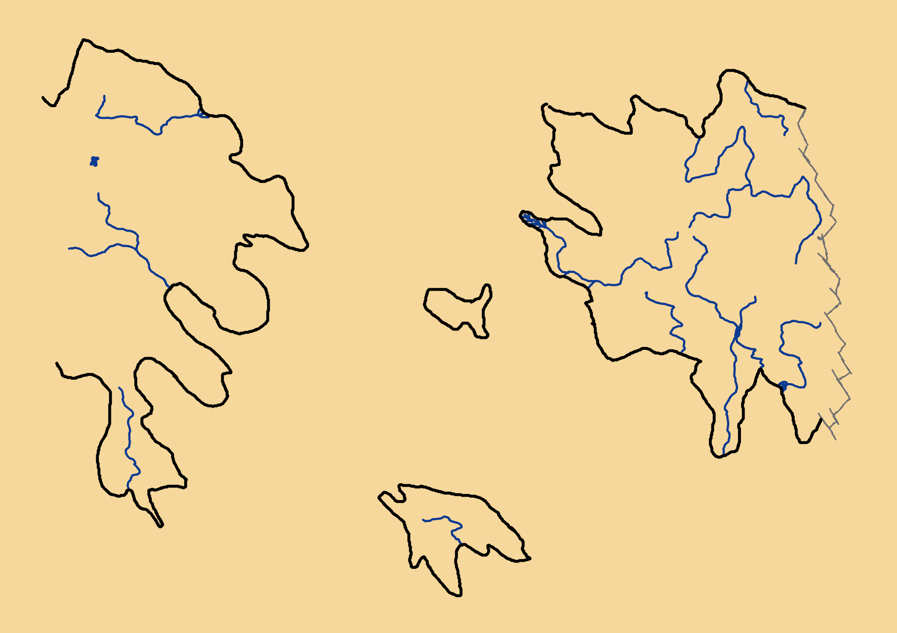

# Nexion - World Map
*This is the fog-of-war version of the world map. In other words, not everything is present yet. This map is meant to give the general information all people on Nexion know: the big areas, the big rivers, the biggest cities.*

## Table of Contents
 - [Table of Contents](./world_fow.md#table-of-contents)
 - [Holy Lands](./world_fow.md#holy-lands)
     - [Hills of Ice](./world_fow.md#hills-of-ice)
     - [Veil of Heaven](./world_fow.md#veil-of-heaven)
     - [Grandfather Plains](./world_fow.md#grandfather-plains)
     - [Gold Shores](./world_fow.md#gold-shores)
     - [Desert of the Ancients](./world_fow.md#desert-of-the-ancients)
     - [Rivers in the Holy Lands](./world_fow.md#rivers-in-the-holy-lands)
 - [Island of Promise](./world_fow.md#island-of-promise)
     - [Freedom Hills](./world_fow.md#freedom-hills)
     - [The Corn Downs](./world_fow.md#the-corn-downs)
     - [Rivers on the Island of Promise](./world_fow.md#rivers-on-the-island-of-promise)
 - [The Old World](./world_fow.md#the-old-world)
     - [The Northern Hills](./world_fow.md#northern-hills)
     - [Arrival Plains](./world_fow.md#arrival-plains)
     - [Frozen Peaks](./world_fow.md#frozen-peaks)
     - [Pine's Range](./world_fow.md#pines-range)
     - [Overgrowth](./world_fow.md#overgrowth)
     - [Infested Swamp](./world_fow.md#infested-swamp)
     - [Lava Foothills](./world_fow.md#lava-foothills)
     - [Storm Desert](./world_fow.md#storm-desert)
     - [Anly Valley](./world_fow.md#anly-valley)
     - [Rivers in The Old World](./world_fow.md#rivers-in-the-old-world)
 - [Avalon](./world_fow.md#avalon)
 - [Seas and Oceans](./word_fow.md#seas-and-oceans)
     - [Ice Ocean](./world_fow.md#ice-ocean)
     - [Central Sea](./world_fow.md#central-sea)
     - [Raven Sea](./world_fow.md#raven-sea)
     - [Strait of Romburgh](./world_fow.md#strait-of-romburgh)
     - [Verdant Bay](./world_fow.md#verdant-bay)
     - [Boiling Bay](./world_fow.md#boiling-bay)
     - [Hurricane Maze](./world_fow.md#hurrican-maze)
     - [Vortex Sea](./world_fow.md#vortex-sea)
     - [The Blood Sea](./world_fow.md#the-blood-sea)
     - [Southern Sea](./world_fow.md#southern-sea)

## Holy Lands
The Holy Lands are named because they lie adjoint to the Gods' Stairway, an impenetrable, unscalable wall of hexagonal pillars, like basalt; but they're as unyielding and smooth as obsidian. Legend has it the Gods' Stairway leads straight up to heaven.
### Hills of Ice
The ![h_ice] are the coldest place on Nexion: hills covered in tundra, as far as the eye can see, constantly tormented by ice-cold winds. The coast north of the Hills of Ice gives way to a frozen sea: snow and ice as far as the eye can see. The sea east of the Hills of Ice is frozen half of the year, and thaws the other half. The southern hills in the area are higher and block the hot southern wind, giving way to the Desert of the Ancients. On the west, the Hills of Ice lead up to the Veil of Heaven.  
Most of the peoples living in the Hills of Ice tend to be strong, independent and distant, the tundra doesn't do well to mercy. When someone from the Hills of Ice gives you their word, you can count on them.

### Veil of Heaven
The highest mountains on Nexion are found in the ![v_heaven]: high, steep, ice-capped peaks separated by deep ravines, streaked through by fast, narrow mountain rivers. If you fall, you're dead. However, here and there, especially closer to the east, there are some really nice valleys. The coast north of the very long mountain range gives way to the permanently frozen Ice Ocean. To the east, the Veil of Heaven is bordered by the ice-cold tundra of the Hills of Ice, the searing Desert of the Ancients and the lush Grandfather Plains. The southern edge of the mountain range touches The Blood Sea, the Verdant Bay and the treacherous Gold Shores. To the west, there's only the impenetrable wall of the God's Stairway.  
The peoples of the Veil of Heaven are proud and haughty: their closeness to the Gods' Stairway makes them think themselves better than the others. They tend to be very religious and brutally honest: they will tell you what's on their mind without thinking about your feelings.

### Grandfather Plains
The ![grandf] know the most extreme weather changes in Nexion: one day brings searing hot, dry wind from the Desert of the Ancients, and the next brings snow and hail from the Veil of Heaven. However, they also know nice, moderate weather when the wind comes from overseas. The vegetation is lush with moorland plants; nothing grows higher than a halfling's head, however. To the north and east of the Grandfather Plains is the Desert of the Ancients. The south is dominated by the Verdant Bay and both south and west have some foothills leading up to the Veil of Heaven.  
The peoples you'll encounter in the Grandfather Plains tend to be open, adaptive, honorable and welcoming. You can always find a place to stay the night. However, they're not very welcoming to long-term visitors: it's not a good place to settle down if you weren't born to the area.

### Gold Shores
The ![gold] is known for the precious metals one can excavate there: gold, silver, copper, iron, ... However, the area itself is unforgiving: deep canyons, fast-running rivers and many, many sinkholes. The vegetation is scarce and people need import food and building materials all the time to survive. Except for the northern edge, leading up to the Veil of Heaven, the Gold Shores are bordered with seas on all sides: the Verdant Bay in the east, the Hurricane Maze in the south and The Blood Sea in the west.  
The peoples on the Gold Shores tend to be scoundrels and gold diggers; usually not afraid of a little mugging or even assassination if it's profitable to them. Petty criminality is very common and the type attracts all kind of low-life jobs: dubious tavern owners, violent gangs, assassins, whores, thugs, hired blades, ... However, if you can beat them in drinking or if you prove yourself to be very tough, they'll leave you alone.

### Desert of the Ancients
The driest area in all of Nexion, the ![des_ancients] hasn't known any rainfall in years. With temperatures rising over 50 Celcius, water is the most valuable resource. However, if you find the right places, you might be able to excavate rare and precious gems. The hot winds of the desert blow against the Hills of Ice in the north, the Central Sea in the east, a myriad of seas in the south and the Grandfather Plains and Veil of Heaven in the west.  
The few peoples you'll find in the desert tend to be hardy and practical. Most oases are walled up by one group or tribe, claiming the oasis for their own. They won't turn you away, but they are shallow and they prefer to see you leave.

### Rivers in the Holy Lands
#### Eatosol
The northernmost river of the Holy Lands, the Eatosol is a big, slow stream that's frozen most of the year. Its banks are as plain as the surrounding tundra. It provides fish to the few people living around it.

#### Shimmering Stream
Mistaken by many people for an illusion, the Shimmering Stream flows along the westernmost border of the Desert of the Ancients. Its banks have a teeming vegetation that's full of birds and other small animals. The river itself however, is devoid of fish.

#### Last Hope
The Last Hope is a big, broad, slow-flowing river teeming with fish. The banks around it are full of small trees and many wild fruit grows along the road right next to it.

#### Death's Channel
The only real source of water in the Gold Shores, Death's Channel is a fast-flowing river that's carved a deep canyon. It is very hard to reach safely and gets its name from its primary cargo: dead bodies.

## Island of Promise
The Island of Promise is a safe place for many. A place where everyone can be who they are. However, this is not really true in the cities: oppression is a big practice and criminality rates are very high. The countryside is safe and popular for minorities.

### Freedom Hills
Home to a myriad of races and tribes, the ![free_h] are known for their total diversity: the hills are home to a lot of different forests, plains, beaches and even a few canyons. There's something for everyone there. The forests have many fruit trees, all kinds of berries and roots grow in the plains and the beaches are teeming with coconut trees. Its beaches extend along the Raven Sea in the north and west, the Southern Sea in the south. The lower hills on the east give way to the fertile grounds of The Corn Downs.  
The peoples in the Freedom Hills are welcoming, inclusive and carefree. There is no real export or trade, because most people are just living their best life. However, you can never have a good night's rest: there's always a party within earshot. Your past doesn't matter here, but to keep the communities safe, justice is swift and irreversible.

### The Corn Downs
Probably the most fertile ground on Nexion, ![corn] are used mainly for agriculture. Their name comes from the main export product of the area. Many little streams draw lines through the area. The few bits of land not yet used as farmland are small forests home to many wild animals. The northern and eastern coast of The Corn Downs gives way to the Strait of Romburgh, while the southern coast touches the Southern Sea and the western area leads up to the Freedom Hills.  
The people in the Corn Downs are either welcoming, rural and honest or sneaky, untrustworthy and egoistical, depending on where you are: the nice people are found on the countryside while the low-life criminals are centered in the big cities that line the Rufil.

### Rivers on the Island of Promise
#### Rufil
While the whole island is crossed by streams, the Rufil is the only large river. Nothing is left of the original banks, everywhere are houses, ports and bridges. The river itself is fit for fishing, but the cities along the river punish fishermen without a license. Getting a license often implies bribing a corrupt clerk in one of the cities where crime rules the roost.

## The Old World
Named The Old World because it was the location where the non-native races (see the [world history](./world-hist.md)) arrived, The Old World is known for having almost every kind of environment.

### The Northern Hills
![northern] cover a large part of the north-east of The Old World. They are covered in tundra. When the thaw comes in summer, the whole area becomes one giant mud pool, where insects soar and buzz. The Ice Ocean lies north of The Northern Hills. The east leads into the deep pine forests of the Pine's Range. The south leads the icy Frozen Peaks and the Arrival Plains. To the west of The Northern Hills borders lie the Anly Valley and the Central Sea.  
The peoples of The Northern Hills are all vastly different but they have one thing in common: they are all strong and independent.

### Arrival Plains
The location where the [Arrival](./world-hist.md#arrival) happened, the ![arrival] are a quite important place to the non-native races. The area itself is green, lush and quite fertile, allowing cities to grow. Probably the most orderly part of the world, the Arrival Plains are home to a few bigger states, in stark contrast to most of the rest of the world, where cohesion is usually just a word. The plains also have some larger forests and some drier patches or savanna as well. The Arrival Plains are bordered by The Northern Hills and the Frozen Peaks in the north, the Overgrowth and Infested Swamp in the east, the Strait of Romburgh in the south and Anly Valley in the west.  
The peoples of the plains tend to be structured and a little calculated. News travels fast and people who aren't welcome in one city won't be welcome in another either. The larger cities, however, are home to a lot of gangs and even some organized crime.

### Frozen Peaks
The combination of a very cold environment and very wet winds, the ![frozen] are permanently covered in a thick layer of snow. Hailstorms, snowstorms, avalanches and landslides are very common and every town has a lot of measures to ensure survival. The few covered valleys are home to a lot of tall pine trees and even a few animals. Being the center of The Old World, the Frozen Peaks go over in The Northern Hills, Pine's Range, the Overgrowth, and the Arrival Plains.  
The few, scattered towns are home to solitary, traditional, secluded people. While they won't let you die in the cold, they are always happier to see you leave then arrive, even though they won't tell you. They have the strongest alcoholic drinks in all of Nexion.

### Pine's Range
Home to a stunning diversity of pine trees, ![pine] is a large, quite cold and quite flat area. The endless rows of pine trees reach as far as the eye can see. They don't allow many other plants to sprout, except for brambles; which caused most cities in Pine's Range to clear a wide circle around the city to grow crops. The Ice Ocean lies north of Pine's Range. The east goes down into the Infernal Deeps, the south gets more lush and transitions smoothly into the Overgrowth, while towards the west, the trees disappear into the tundra of The Northern Hills.  
Most of the people in Pine's Range, except for the solitary firbolg, are warm and welcoming, happy to see a new face in town. They'll allow you to pay for your accommodation in stories and tales from faraway lands. However, once they have heard all your stories, they'll ask you politely to help in the forest or on the fields.

### Overgrowth
The densest vegetation on Nexion is found in the ![overgr]; it's one giant tangle of vines, trees, bushes, undergrowth and other plant life. Both temperate and tropical jungle is found in the Overgrowth. Rain is abundant and many fruits are edible. However, the poisonous ones are very lethal. Animal life is very abundant as well: birds chittering, rodents skittering across the floor, insects buzzing through the air, mammals hunting, ... The only places where the Overgrowth is less dense is around the cities and towards the edges of the forest: Pine's Range in the north, the Infernal Deeps in the east, the Lava Foothills and Storm Desert in the south and the Frozen Peaks and Arrival Plains in the west.  
The peoples of the Overgrowth are as diverse as the Overgrowth itself: some are welcoming, some are xenophobic. Some are trustworthy while others will stab your back given the slightest chance.

### Infested Swamp
Brooding grounds for billions of insects, bugs and mosquitoes, the ![swamp] is usually avoided by most. To navigate, one must stay on the few wooden, mostly rotten walkways, or barge through endless mud, streams and puddles of quicksand. All the towns is built on large, wooden pillars. The Vortex Sea in the south floods the Infested Swamp at least twice a year. To the north, the mud and quicksand change into the moss of the Overgrowth, while the east is dried by the endless sun of the Storm Desert. To the west are the cobbled roads of the Arrival Plains.  
Most communities in the Infested Swamp value their privacy and aren't keen on visitors. Some of them even go as far as to assassinate visitors in their sleep. However, trade is abundant in the Infested Swamp: local traders do their business, no questions asked.

### Lava Foothills
The ![lava] are the only volcanic area on all of Nexion. Almost nothing grows there and most towns have their spellcasters to protect the town from eruptions, lava streams and similar natural effects. However, the area is very popular for traders, as the hard-to-get obsidian originates there. Many rich people in the rest of the world also buy other volcanic products to show off in their homes. To the east, the volcanoes give way to the Infernal Deeps, to the south-west they give way to the Storm Desert and to the north-west lies the lush forest of the Overgrowth.  

### Storm Desert
There's always a storm raging in the ![storm_des], the weather is as treacherous as it can be. One moment, you're in the glaring sun, the next a sandstorm is racing your way. The ground would be littered with corpses if the storms didn't bury them immediately under a few metres of sand. The safest (and most populated) areas within the Storm Desert are along the edges: north-east along the Lava Foothills, east along the Infernal Deeps, south along the Vortex Sea, west along the Infested Swamp and north-west along the Overgrowth.  
The people there are hardy and unyielding. Most of the surviving tribes have perfected techniques to predict and/or survive storms. However, the true masters are the tabaxi: they can perfectly predict and sometimes even avoid storms, making them the only nomadic people of the Storm Desert.

### Anly Valley
Named after the Anly river, the ![anly] is a lush plains, fit for agriculture, trading, and logging. In the river and along the coast, seafood and rare fish are found. Due to the abundant food, the area thrives from export. The diamond-shaped valley rises to the north-east to The Northern Hills, and to the south-east to the Arrival Plains. Its coasts lead into the Strait of Romburgh in the south and into the Central Sea to the west.  
The people in Anly Valley's cities tend to be rather materialistic and even a bit egoistic. However, the countryside people are very welcoming and warm, and they will gladly give you dinner and a place to sleep provided you help them out on the farms.

### Rivers in The Old World
#### Arctic Beck
The northernmost river on Nexion, the Arctic Beck is frozen most of the year. Its banks are devoid of anything, mostly because the ice harms plants rather than helps them to water. There is no fish nor any other life in the Arctic Beck.

#### Emerald Stream
The Emerald Stream is the biggest river of the Overgrowth, flowing slowly through it. It's also the main "road" through the dense forest; in almost any city along the river you can hire a boat to row it down (rowing is necessary as the plants block all the wind). It's teeming with fish and aquatic mammals. To the north, where it flows through Pine's Range, the vegetation along the banks gets a little less dense and the aquatic animals are rarer.

#### Irorood
Another ice-cold river, the Irorood has an ever-changing course and look. Up in the Frozen Peaks, it flows fast, taking blocks of ice and large rocks with it. Down in Pine's Range, it's teeming with salmon.

#### Anly
The Anly is the main reason for Anly Valley's riches; bringing down silt and slib from the Frozen Peaks, it fertilizes the whole valley. Once it reaches the valley, it slows down and widens, allowing for very lush vegetation along the banks and rich life in the river itself. It is rumored that some tritons even have a second home in the river.

#### Stream of Liberty
The first river to be seen by the colonists, the Stream of Liberty got its name out of gratefulness. It's a calm and broad river, crossing a large part of the Arrival Plains. It bursts its banks every other year, flooding and fertilizing a large part of the plains.

#### Sultama
In a far past, the Sultama used to have another, forgotten name. However, one day, a rich, egoistic kleptomaniac called Sultama was thrown into it, for stealing and cheating on the whole town. They enchanted all his expensive, colorful clothes such that those wouldn't get stuck anywhere and then hung the clothes from Sultama's feet, before drowning him in the river. Every town he passed, the fraud was recognized.

#### Mocking Stream
The second biggest river in the Overgrowth, the Mocking Stream got its name from the sound of the peculiar fish living in it. Those fish, the mockois, make a sound reminiscent of laughter. It is custom for very rich people to have a few mockois in the fountains in their gardens all over the world.

#### Jade River and Jade Stream
Two rivers springing from the Prophet's Lake, the Jade River and Jade Stream got their names from the mineral frequently found on their bottom and banks.

## Avalon
![avalon] is an anomaly: it's a mythical island. Several sailors and crews claim to have been there, and they can pinpoint it on a map, but none who search for it ever find it. The sailors who have been there, or claim so, all agree on the nature of the place: it's a lush place, with giant lizards walking around, ruled by another giant lizard. They claim to have seen another kind of humanoid. A new species, not the mythical Oppressor (see the [world history](./world-hist.md#oppressor)).

## Seas and Oceans
![todo]

[//]: # (links)
[h_ice]: https://img.shields.io/badge/-Hills_of_Ice-brown
[v_heaven]: https://img.shields.io/badge/-Veil_of_Heaven-lightgrey
[grandf]: https://img.shields.io/badge/-Grandfather_Plains-green
[gold]: https://img.shields.io/badge/-Gold_Shores-brown
[des_ancients]: https://img.shields.io/badge/-Desert_of_the_Ancients-yellow
[free_h]: https://img.shields.io/badge/-Freedom_Hills-brown
[corn]: https://img.shields.io/badge/-The_Corn_Downs-green
[northern]: https://img.shields.io/badge/-The_Northern_Hills-brown
[arrival]: https://img.shields.io/badge/-Arrival_Plains-green
[frozen]: https://img.shields.io/badge/-Frozen_Peaks-lightgrey
[pine]: https://img.shields.io/badge/-Pine's_Range-darkgreen
[overgr]: https://img.shields.io/badge/-Overgrowth-darkgreen
[swamp]: https://img.shields.io/badge/-Infested_Swamp-pink
[lava]: https://img.shields.io/badge/-Lava_Foothills-brown
[storm_des]: https://img.shields.io/badge/-Storm_Desert-yellow
[anly]: https://img.shields.io/badge/-Anly_Valley-green

[avalon]: https://img.shields.io/badge/-Avalon-purple

[ice_o]: https://img.shields.io/badge/-Ice_Ocean-blue
[central]: https://img.shields.io/badge/-Central_Sea-blue
[raven]: https://img.shields.io/badge/-Raven_Sea-blue
[romb]: https://img.shields.io/badge/-Strait_of_Romburgh-blue
[verdant]: https://img.shields.io/badge/-Verdant_Bay-blue
[boil]: https://img.shields.io/badge/-Boiling_Bay-blue
[maze]: https://img.shields.io/badge/-Hurricane_Maze-blue
[vortex]: https://img.shields.io/badge/-Vortex_Sea-blue
[blood]: https://img.shields.io/badge/-The_Blood_Sea-blue
[southern]: https://img.shields.io/badge/-Southern_Sea-blue

[todo]: https://img.shields.io/badge/Status-To_Do-important
